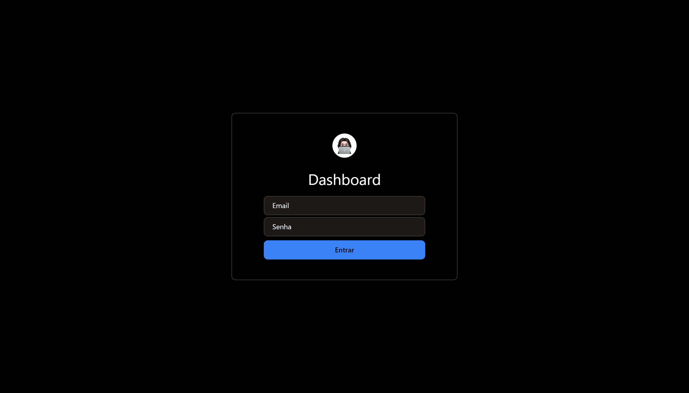

# Dashboard

> **Warning**
> This is a work-in-progress and not the finished product.
>
> Feel free to leave feature suggestions but please don't open issues for bugs or support requests just yet.

[](https://dashboard.marinhomich.dev/)

<!-- ## Introduction

This project aims to showcase the power and flexibility of React for building modern, interactive, and responsive web applications. Whether you're a beginner or an experienced developer, this project can serve as a starting point for your React-based web application. -->

## Tech Stack

- **Framework:** [Next.js](https://nextjs.org)
- **Styling:** [Tailwind CSS](https://tailwindcss.com)
- **ORM:** [Prisma](https://www.prisma.io/)
- **UI Components:** [shadcn/ui](https://ui.shadcn.com/)
- **Email:** [React Email](https://react.email)
- **Payments infrastructure:** [Stripe](https://stripe.com)
<!-- - **File Uploads:** [uploadthing](https://uploadthing.com) -->

## Running Locally

Follow these steps to get the project up and running on your local machine:

1. Clone this repository to your local machine using the following command:

```bash
git clone https://github.com/marinhomich/dashboard.git
```

2. Navigate to the project directory:

```bash
cd dashboard
```

3. Install dependencies using pnpm:

```bash
pnpm install
```

4. Start the development server:

```bash
pnpm run dev
```

## Using Docker

1. Build your container:

```bash
docker build -t nextjs-docker .
```

2. Run your container:

```bash
docker run -p 3000:3000 nextjs-docker
```

<!-- ## Folder Structure

The project's folder structure is organized as follows:

    template/
    ├── node_modules/          # Node.js modules and dependencies
    ├── public/                # Static files that will be served directly
    │   ├── index.html         # Main HTML template
    │   └── ...
    ├── src/                   # Source code directory for your React application
    │   ├── api/               #
    │   │   └── ...
    │   ├── assets/            #
    │   │   └── ...
    │   ├── components/        # Reusable React components
    │   │   └── ...
    │   ├── lib/               #
    │   │   └── ...
    │   ├── routes/            # React components for each page/route
    │   │   └── ...
    │   ├── theme/             #
    │   │   └── ...
    │   └── main.jsx           # Entry point of the application
    ├── .gitignore             # List of files/folders to be ignored by Git
    ├── package.json           # Project configuration and dependencies
    ├── README.md              # Project documentation
    └── vite.config.js         # Vite configuration file -->

## Contributing

Contributions are welcome and encouraged! If you'd like to contribute to this project, please follow our [contribution guidelines](CONTRIBUTING.md).

## License

This project is licensed under the [MIT License](LICENSE). Feel free to use and modify the code as per the terms of the license.
